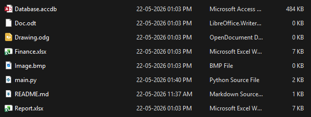
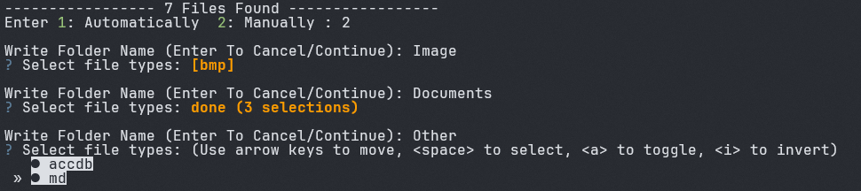
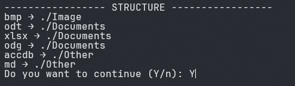
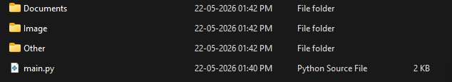

## About
This is a python script which organize files into folder based on their types

## How To Use
1. Install the `questionary` library using `pip install questionary` or run:
    ```
    pip install -r requirements.txt
    ```
2. Place the main.py folder in the folder you want to organize and then run the python file

## Example
Folder Before Running The Script



Run the Script - Select Manual Arrangement - Enter folder names and selected respective types




Verify Final Structure



Folder After Running the Script

